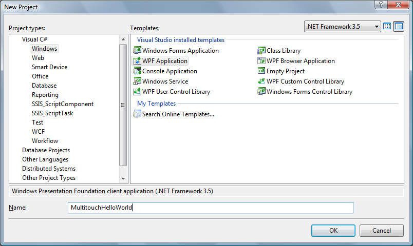
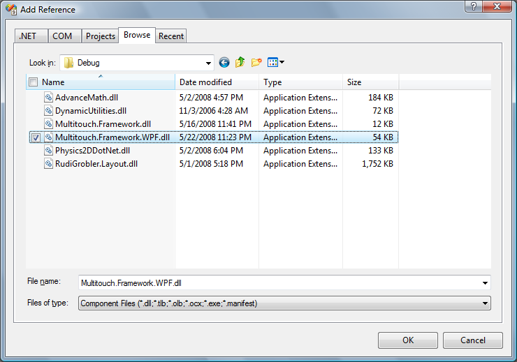
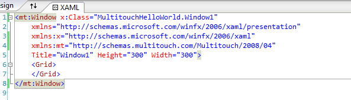
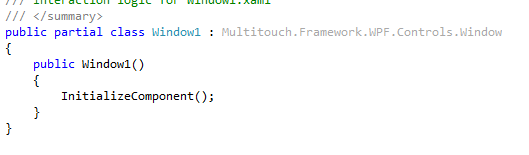
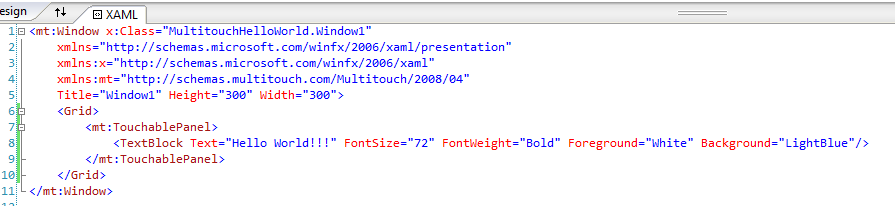
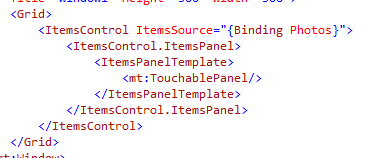
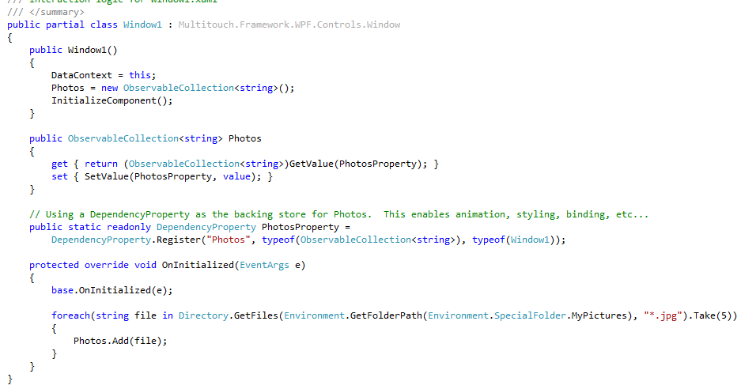
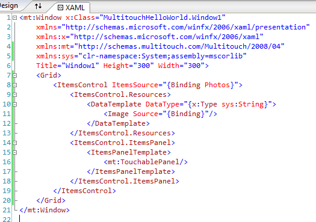

# Multitouch "Hello World" program

Start Visual Studio and create a new WPF project and name it "MultitouchHelloWorld".

Add reference to Multitouch.Framework.WPF.dll assembly.

In **Window1.xaml** add a new namespace: _xmlns:mt="http://schemas.multitouch.com/Multitouch/2008/04"_, and change root object _<Window>_ to _<mt:Window>_. Don't forget to close it with _</mt:Window>. Then open **Window1.cs** and change _Window1_ base object from _Window_ to _Multitouch.Framework.WPF.Controls.Window_.
Your xaml should look like this:

and cs file like this:

Now add a _TouchablePanel_ as a child of _Grid_ and _TextBlock_ as a child of _TouchablePanel_. Set the _Text_ property of _TextBlock_ to "Hello World!!!".
Let's make this text bigger, so we could easily touch it. Set _FontSize_ property to 72, _FontWeight_ to Bold and make _Foreground_ White and _Background_ LightBlue.

Our program is ready. Before you start it, you have to start multitouch service. For example by executing _Multitouch.Service.Console.exe_.
Now hit F5 to start the program. Your program will look like this and you can touch the text and move and rotate it around.

Let's make our program a little more useful. Replace _TouchablePanel_ with _ItemsControl_ and set its _ItemsPanel_ to _TouchablePanel_. Now bind _ItemsSource_ to Photos property with _{Binding Photos}_.

Now let's write some code. Open **Window1.cs** file. And add a new DependencyProperty Photos of type _ObservableCollection<string>. In constructor, before _InitializeComponent_ is executed, set _DataContext_ to _this_. Now override _OnInitialized_ method and add this code:

{{
foreach(string file in Directory.GetFiles(Environment.GetFolderPath(Environment.SpecialFolder.MyPictures), "*.jpg").Take(5))
{
	Photos.Add(file);
}
}}

It will take 5 pictures from you **Pictures** folder, so make sure you have them.
Finally let's get back to **Window1.xaml** and add a DataTemplate to display strings as Images.

Now start the program and enjoy your Multitouch Photo Album :)